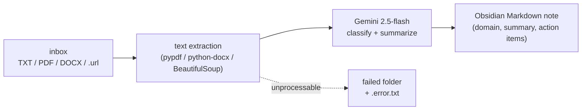
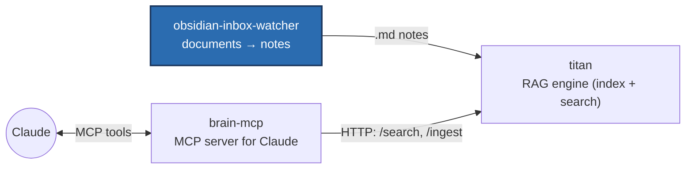

# obsidian-inbox-watcher

**A local folder watcher that turns dropped documents into structured Obsidian
notes with an LLM (Google Gemini) — the document front end to a local RAG system.**

It watches a raw inbox for **TXT / PDF / DOCX / `.url`** files, extracts the text
(crawling the page for URLs), classifies and summarizes it with `gemini-2.5-flash`,
writes a clean Markdown note (YAML frontmatter, action items, open questions) and
archives the original. Anything it can't process is set aside with an error note
instead of being retried forever.

## What it does



It runs perfectly **standalone** — it just writes the notes into a folder you
choose. Optionally it becomes the entry gate of a RAG system: point the output
folder into the vault of **[titan](https://github.com/charlieLucke/titan)** (the
local RAG system, separate repo) and the `brain-watcher` auto-indexes every
generated note and makes it searchable.

## Part of a larger system

This watcher closes the gap that the RAG system only auto-ingests `.md` files by
default — PDFs, DOCX and web links would otherwise need manual steps.



- **obsidian-inbox-watcher** *(you are here)* — raw documents → structured notes.
- **[titan](https://github.com/charlieLucke/titan)** — indexes the notes and
  answers search queries (hybrid vector search).
- **[brain-mcp](https://github.com/charlieLucke/brain-mcp)** — connects titan to
  Claude over MCP.

## Technical highlights

- **Robustness by design:** a stable-size check (only process a file once it has
  finished writing), bounded retry with exponential backoff for transient
  Gemini/network failures, and a **dead-letter mechanism** for poison inputs — a
  corrupt file never blocks the queue.
- **Filesystem-aware watching:** `select_observer()` picks native inotify vs.
  polling by the actual filesystem type (from `/proc/mounts`) — needed because
  inotify is unreliable on WSL `/mnt` mounts and Syncthing delivers files via
  rename (`on_moved`) rather than create.
- **No overwriting:** `unique_output_path()` versions collisions (`_v2`, `_v3`), so
  a note edited in Obsidian is never silently lost.
- **Decoupled:** the integration with titan runs purely over the shared filesystem
  — no API coupling, both services stay independent.

## Prerequisites

- **Linux or WSL2.** The watcher runs as a systemd user service and reads
  `/proc/mounts` to pick its watching strategy.
- **Python 3.12+** and **[uv](https://docs.astral.sh/uv/)**.
- **A Google Gemini API key** (the free tier is enough to try it) from
  [Google AI Studio](https://aistudio.google.com/app/apikey).
- **(Optional) titan + `brain-watcher`** for the RAG integration — *not* required.

PDF/DOCX/HTML parsing comes from Python dependencies (`pypdf`, `python-docx`,
`beautifulsoup4`) that `uv` installs for you — no extra system packages.

## Quickstart (standalone)

```bash
# 1. Install dependencies and the git pre-commit hooks
make install

# 2. Provide your Gemini API key (the only required setting)
mkdir -p ~/.config/vault_watcher
echo 'GEMINI_API_KEY=your-real-key-here' > ~/.config/vault_watcher/env
chmod 600 ~/.config/vault_watcher/env   # the file holds a secret

# 3. Run it (the working folders are created on first start)
make run
```

With only the key set, the watcher uses these default folders and creates them
automatically:

- drop files into **`~/0_Pipeline/In`**
- finished notes appear in **`~/0_Pipeline/Out`**
- originals are moved to **`~/0_Pipeline/Archive`**
- unprocessable files go to **`~/0_Pipeline/Failed`** (with a `.error.txt` reason)

## Configuration

Set these in `~/.config/vault_watcher/env` (loaded by the app and by systemd; use
absolute paths):

| Variable | Purpose | Default |
|---|---|---|
| `GEMINI_API_KEY` | Gemini API key (required) | — |
| `VAULT_WATCHER_RAW_DIR` | folder watched for new files | `~/0_Pipeline/In` |
| `VAULT_WATCHER_PROCESSED_DIR` | where notes are written | `~/0_Pipeline/Out` |
| `VAULT_WATCHER_ARCHIVE_DIR` | where originals are moved | `~/0_Pipeline/Archive` |
| `VAULT_WATCHER_FAILED_DIR` | dead-letter dir (+ `.error.txt` sidecar) | `~/0_Pipeline/Failed` |
| `VAULT_WATCHER_DOMAINS` | seed domains for classification (Gemini may add new ones) | `business,lernen,projekte,system` |
| `VAULT_WATCHER_MAX_CHARS` | max characters sent to Gemini (truncated + logged beyond) | `200000` |

Notes carry a `domain:` frontmatter field required by titan (Gemini picks from the
seed list or creates a new domain). For the titan integration, set
`VAULT_WATCHER_PROCESSED_DIR` to a folder inside the RAG vault; keep the raw and
archive dirs *outside* the vault. Details in
[`docs/ai/ARCHITECTURE.md`](docs/ai/ARCHITECTURE.md).

## Run & develop

```bash
make run        # run the watcher locally
make test       # run tests with coverage
make check      # full quality gate: lint + types + tests
make format     # auto-fix style issues
make help       # list all available commands
```

Deploy as a systemd user service — see [`deploy/README.md`](deploy/README.md).

## Project Structure

```
src/obsidian_inbox_watcher/    Source code (watcher, extractors, Gemini call, note rendering)
tests/               Pytest tests (mirrors src/ layout)
deploy/              systemd user units (workstation + always-on hub) + guide
docs/ai/             architecture, decisions and plans
.github/workflows/   CI configuration
```

## Tooling

| Tool         | Purpose                              |
|--------------|--------------------------------------|
| **uv**       | Package manager + Python installer   |
| **ruff**     | Linter + formatter                   |
| **mypy**     | Static type checker (strict mode)    |
| **pytest**   | Test runner with coverage            |
| **pre-commit** | Git hook runner                    |

All tools run in CI on every push.

## Documentation & developer workflow

In-depth architecture (including a data-flow diagram and the hub topology) and
design decisions live in [`docs/ai/`](docs/ai/). These files also drive a
structured AI-assisted development workflow; `CLAUDE.md` (mirrored as
`AGENTS.md`/`GEMINI.md`) is the entry point for any agent.

🇩🇪 Eine deutsche Fassung dieser README gibt es unter [README.de.md](README.de.md).

## License

MIT — see [LICENSE](LICENSE).
