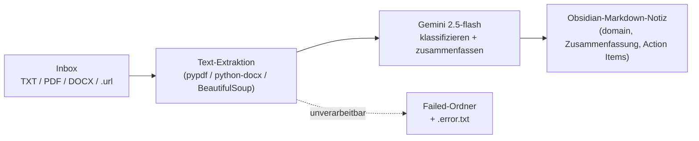

# obsidian-inbox-watcher

**Ein lokaler Ordner-Watcher, der eingeworfene Dokumente mit einem LLM (Google
Gemini) automatisch in strukturierte Obsidian-Notizen verwandelt — das
Dokument-Frontend zu einem lokalen RAG-System.**

Er überwacht eine Roh-Inbox auf **TXT- / PDF- / DOCX- / `.url`**-Dateien,
extrahiert den Text (crawlt bei URLs die Seite), klassifiziert und fasst ihn mit
`gemini-2.5-flash` zusammen, schreibt eine saubere Markdown-Notiz (YAML-Frontmatter,
Action Items, offene Fragen) und archiviert das Original. Was nicht verarbeitet
werden kann, wird mit einer Fehlernotiz beiseitegelegt statt endlos wiederholt.

## Was es macht



Der Dienst läuft **standalone** — er schreibt die Notizen einfach in einen von dir
gewählten Ordner. Optional wird er zum Eingangstor eines RAG-Systems: zeigt der
Ausgabeordner in den Vault von
**[titan](https://github.com/charlieLucke/titan)** (dem lokalen RAG-System,
separates Repo), indexiert der `brain-watcher` jede erzeugte Notiz automatisch und
macht sie durchsuchbar.

## Teil eines größeren Systems

Dieser Watcher schließt die Lücke, dass das RAG-System von Haus aus nur `.md`-Dateien
automatisch aufnimmt — PDFs, DOCX und Web-Links bräuchten sonst manuelle Schritte.


- **obsidian-inbox-watcher** *(du bist hier)* — Rohdokumente → strukturierte Notizen.
- **[titan](https://github.com/charlieLucke/titan)** — indexiert die Notizen und
  beantwortet Suchanfragen (hybride Vektorsuche).
- **[brain-mcp](https://github.com/charlieLucke/brain-mcp)** — bindet titan über
  MCP an Claude an.

## Technische Highlights

- **Robustheit by design:** Stable-Size-Check (Datei erst verarbeiten, wenn sie
  fertig geschrieben ist), begrenzter Retry mit exponentiellem Backoff für
  transiente Gemini-/Netzwerk-Fehler, und ein **Dead-Letter-Mechanismus** für
  „Poison"-Inputs — eine korrupte Datei blockiert nie die Queue.
- **Dateisystem-bewusste Überwachung:** `select_observer()` wählt anhand des
  tatsächlichen Dateisystem-Typs (aus `/proc/mounts`) zwischen nativem inotify und
  Polling — nötig, weil inotify auf WSL-`/mnt`-Mounts unzuverlässig ist und
  Syncthing Dateien per Rename (`on_moved`) statt Create zustellt.
- **Kein Überschreiben:** `unique_output_path()` versioniert Kollisionen (`_v2`,
  `_v3`), damit eine in Obsidian editierte Notiz nie still verloren geht.
- **Entkoppelt:** Die Integration mit titan läuft ausschließlich über das gemeinsame
  Dateisystem — kein API-Coupling, beide Dienste bleiben unabhängig.

## Voraussetzungen

- **Linux oder WSL2.** Der Watcher läuft als systemd-User-Service und liest
  `/proc/mounts`, um seine Überwachungsstrategie zu wählen.
- **Python 3.12+** und **[uv](https://docs.astral.sh/uv/)**.
- **Ein Google-Gemini-API-Key** (der Free Tier reicht zum Ausprobieren) aus dem
  [Google AI Studio](https://aistudio.google.com/app/apikey).
- **(Optional) titan + `brain-watcher`** für die RAG-Integration — *nicht* erforderlich.

PDF-/DOCX-/HTML-Parsing kommt aus Python-Abhängigkeiten (`pypdf`, `python-docx`,
`beautifulsoup4`), die `uv` für dich installiert — keine zusätzlichen Systempakete.

## Schnellstart (standalone)

```bash
# 1. Abhängigkeiten und die git-pre-commit-Hooks installieren
make install

# 2. Deinen Gemini-API-Key bereitstellen (das einzige Pflicht-Setting)
mkdir -p ~/.config/vault_watcher
echo 'GEMINI_API_KEY=dein-echter-key-hier' > ~/.config/vault_watcher/env
chmod 600 ~/.config/vault_watcher/env   # die Datei enthält ein Geheimnis

# 3. Ausführen (die Arbeitsordner werden beim ersten Start angelegt)
make run
```

Mit nur gesetztem Key nutzt der Watcher diese Default-Ordner und legt sie
automatisch an:

- Dateien in **`~/0_Pipeline/In`** ablegen
- fertige Notizen erscheinen in **`~/0_Pipeline/Out`**
- Originale werden nach **`~/0_Pipeline/Archive`** verschoben
- unverarbeitbare Dateien gehen nach **`~/0_Pipeline/Failed`** (mit `.error.txt`-Grund)

## Konfiguration

Diese in `~/.config/vault_watcher/env` setzen (von der App und von systemd geladen;
absolute Pfade verwenden):

| Variable | Zweck | Default |
|---|---|---|
| `GEMINI_API_KEY` | Gemini-API-Key (erforderlich) | — |
| `VAULT_WATCHER_RAW_DIR` | auf neue Dateien überwachter Ordner | `~/0_Pipeline/In` |
| `VAULT_WATCHER_PROCESSED_DIR` | wohin Notizen geschrieben werden | `~/0_Pipeline/Out` |
| `VAULT_WATCHER_ARCHIVE_DIR` | wohin Originale verschoben werden | `~/0_Pipeline/Archive` |
| `VAULT_WATCHER_FAILED_DIR` | Dead-Letter-Verzeichnis (+ `.error.txt`-Sidecar) | `~/0_Pipeline/Failed` |
| `VAULT_WATCHER_DOMAINS` | Seed-Domains für die Klassifikation (Gemini darf neue ergänzen) | `business,lernen,projekte,system` |
| `VAULT_WATCHER_MAX_CHARS` | max. an Gemini gesendete Zeichen (darüber gekürzt + geloggt) | `200000` |

Notizen tragen ein von titan benötigtes `domain:`-Frontmatter-Feld (Gemini wählt aus
der Seed-Liste oder erstellt eine neue Domain). Für die titan-Integration
`VAULT_WATCHER_PROCESSED_DIR` auf einen Ordner innerhalb des RAG-Vaults setzen; Roh-
und Archiv-Verzeichnisse *außerhalb* des Vaults halten. Details in
[`docs/ai/ARCHITECTURE.md`](docs/ai/ARCHITECTURE.md).

## Ausführen & Entwickeln

```bash
make run        # den Watcher lokal ausführen
make test       # Tests mit Coverage ausführen
make check      # vollständiges Quality-Gate: Lint + Typen + Tests
make format     # Style-Probleme automatisch beheben
make help       # alle verfügbaren Befehle auflisten
```

Als systemd-User-Service deployen — siehe [`deploy/README.md`](deploy/README.md).

## Projektstruktur

```
src/obsidian_inbox_watcher/    Quellcode (Watcher, Extraktoren, Gemini-Call, Notiz-Rendering)
tests/               Pytest-Tests (spiegelt das src/-Layout)
deploy/              systemd-User-Units (Workstation + Always-on-Hub) + Anleitung
docs/ai/             Architektur, Entscheidungen und Pläne
.github/workflows/   CI-Konfiguration
```

## Tooling

| Tool         | Zweck                                |
|--------------|--------------------------------------|
| **uv**       | Paketmanager + Python-Installer      |
| **ruff**     | Linter + Formatter                   |
| **mypy**     | Statischer Typprüfer (Strict Mode)   |
| **pytest**   | Test-Runner mit Coverage             |
| **pre-commit** | Git-Hook-Runner                    |

Alle Tools laufen bei jedem Push in der CI.

## Dokumentation & Entwickler-Workflow

Vertiefende Architektur (inkl. Datenfluss-Diagramm und Hub-Topologie) und
Designentscheidungen liegen in [`docs/ai/`](docs/ai/). Diese Dateien dienen zugleich
einem strukturierten KI-gestützten Entwicklungsworkflow; `CLAUDE.md` (gespiegelt als
`AGENTS.md`/`GEMINI.md`) ist der Einstiegspunkt für jeden Agenten.


## Lizenz

MIT — siehe [LICENSE](LICENSE).
