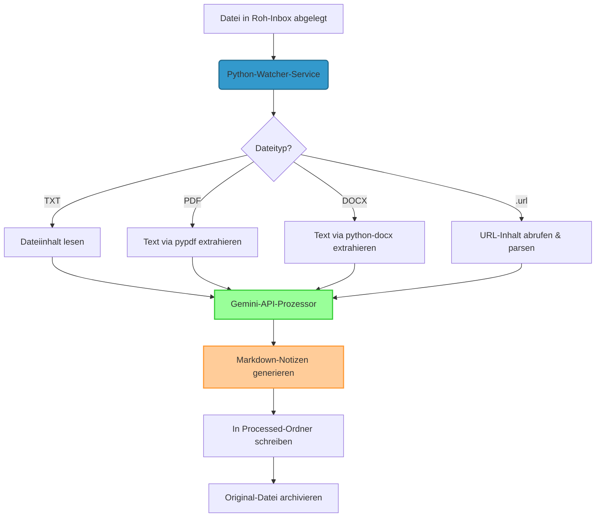

# Architektur

> Design auf Systemebene. Aktualisieren, wenn sich Module, Contracts oder Datenmodelle ändern.

## Überblick

Der Obsidian-Vault-Inbox-Watcher ist ein vollständig autonomer clientseitiger Agent-Service, der ein Verzeichnis überwacht, Dateien lokal mit Python verarbeitet, Textinhalte basierend auf MIME-Typen extrahiert, die Google-Gemini-API zum Strukturieren der Daten anstößt und strukturierte Markdown-Dateien in ein Obsidian-Vault-Verzeichnis schreibt.



## Modulübersicht

```text
src/obsidian_inbox_watcher/
├── __init__.py           # Paket-Importe
├── __main__.py           # Ausführbarer Einstiegspunkt
└── main.py               # Single-Modul-Service
    ├── load_env_file()              # ~/.config/vault_watcher/env in os.environ laden
    ├── resolve_dir()                # Ein Verzeichnis aus einer Env-Var lesen, sonst Default
    ├── get_known_domains()          # Seed-Domain-Liste (VAULT_WATCHER_DOMAINS)
    ├── normalize_domain()           # kleingeschriebenes, leerzeichenfreies Token für Qdrant-Filter
    ├── get_max_chars()              # Prompt-Zeichenlimit (VAULT_WATCHER_MAX_CHARS)
    ├── load_api_key()               # Gemini-Key aus Env / Config-Datei
    ├── _filesystem_type()           # /proc/mounts-Lookup des zugrunde liegenden fs
    ├── select_observer(watch_dir)   # PollingObserver auf drvfs/9p/Netzwerk-fs, sonst inotify
    ├── wait_for_file_to_be_written()# Größen-Stabilitäts-Check
    ├── _is_transient() / _retryable # Retry-Prädikat + gemeinsame tenacity-Policy
    ├── _http_get() / _generate_note_json()  # Retried URL-Fetch + Gemini-Call
    ├── _extract_text(filepath, ext) # txt/pdf/docx/url → (text, source_origin)
    ├── _dead_letter()               # unverarbeitbaren Input verschieben → failed_dir + .error.txt
    ├── unique_output_path()         # nicht-überschreibender Notiz-Pfad (_v2/_v3-Suffix)
    ├── process_file(processed_dir, archive_dir, failed_dir)  # Extrahieren + Gemini + schreiben/archivieren/dead-letter
    ├── process_existing_files()     # beim Start bereits vorhandene Dateien abarbeiten
    ├── InboxHandler(processed_dir, archive_dir, failed_dir)  # on_created/on_moved → _maybe_process → process_file
    ├── _rescan_loop()               # Daemon-Thread: periodischer Safety-Net-Rescan
    └── main()                       # Config auflösen, Observer + Rescan starten, Monitor-Loop
```

## Datenmodell & Formate

### Unterstützte Inputs
1. **TXT (`.txt`)**: Als standardmäßiger UTF-8-String gelesen.
2. **PDF (`.pdf`)**: Seite für Seite via `PdfReader` aus `pypdf` geparst.
3. **DOCX (`.docx`)**: Absatz für Absatz via `docx.Document` geparst.
4. **URL (`.url`)**: Mit standardmäßiger `ini`-Struktur geparst, sucht nach `URL=...`. Die Webseite wird mit `requests` und einem Chromium-User-Agent angefragt, HTML-Tags (`script`, `style`, `nav`, `footer` usw.) via `BeautifulSoup` zerlegt, um lesbaren Body-Text zu isolieren.

### Ausgabe-Obsidian-Markdown-Notiz

`domain` steht zuerst und ist **von Titan erforderlich** (`read_markdown` wirft, wenn es
fehlt/leer ist; stattdessen `indexed: false` setzen, um eine Notiz zu überspringen). Es wird zu
einem kleingeschriebenen, leerzeichenfreien Token normalisiert, weil Titan in Qdrant exakt darauf filtert. Die
H1 wird zu Titans `document_title`. Die anderen Frontmatter-Keys sind zusätzlicher Kontext
für Obsidian und werden von Titan ignoriert.

```markdown
---
domain: [bestehende Titan-Domain oder eine neue, die Gemini gewählt hat]
created: JJJJ-MM-TT
source: [absoluter Dateipfad oder gecrawlte URL]
tags: ["tag1", "tag2", "tag3", "tag4", "tag5"]
ai_processed: true
---
# [Präziser deutscher Titel]

## Zusammenfassung
[Deutsche Zusammenfassung]

## Wissenslücken / Fragen an mich
> [!IMPORTANT]
> [Identifizierte Fragen oder Wissenslücken]

## Action Items
- [ ] [Action Item 1]
- [ ] [Action Item 2]
```

## Externe Services
1. **Google-Gemini-API**: Nutzt das Modell `gemini-2.5-flash` mit erzwungenem strukturiertem Output (`response_mime_type="application/json"`). Der Prompt erhält die Seed-Domain-Liste (`VAULT_WATCHER_DOMAINS`) und klassifiziert den Inhalt in eine bestehende Titan-Domain oder eine neue. Erfordert einen gültigen `GEMINI_API_KEY`, geladen aus `~/.config/vault_watcher/env` oder dem System-Environment.
2. **Ziel-Webserver**: Dynamisch angefragt beim Verarbeiten von `.url`-Shortcuts, um Informationen abzurufen. Timeout auf 15s gesetzt.

## Datenfluss
1. **Erkennung**: `watchdog` feuert `on_created` (normales Create) oder `on_moved` (Temp-Write-dann-Rename, z. B. Syncthing). Beide laufen über `InboxHandler._maybe_process`, das das Archiv-Verzeichnis überspringt, die Erweiterungs-Allowlist anwendet und mit einem In-Flight-Set gegen Doppelverarbeitung absichert. Ein Daemon-Thread rescannt das Roh-Verzeichnis außerdem alle 60 s als Safety-Net für etwaige verpasste Events.
2. **Settle**: Der aktive Loop wartet bis zu 10 Sekunden, bis die Dateigröße sich stabilisiert.
3. **Extraktion**: `_extract_text` isoliert lesbaren Text basierend auf der Erweiterung; der URL-Fetch wird bei transienten Fehlern wiederholt. Überschreitet der Text `VAULT_WATCHER_MAX_CHARS` (Default 200k), wird er gekürzt und eine Warnung geloggt.
4. **API-Prompting**: Bereitet einen strikten deutschen System-Instruction-Prompt vor und sendet ihn via `_generate_note_json` an Gemini, das transiente Fehler (429/5xx/Netzwerk) mit begrenztem exponentiellem Backoff wiederholt.
5. **Obsidian-Write**: Parst das zurückgegebene JSON und speichert die YAML-Frontmatter-Notiz unter `VAULT_WATCHER_PROCESSED_DIR` (Default `~/0_Pipeline/Out`; in diesem Deployment auf `/mnt/f/vault/notes/inbox` gesetzt). `unique_output_path` hängt einen `_v2`/`_v3`-Suffix an, statt eine bestehende Notiz zu überschreiben.
6. **Clean**: Die Original-Datei wird nach `VAULT_WATCHER_ARCHIVE_DIR` (Default `~/0_Pipeline/Archive`) verschoben, mit Zeitstempel-Suffix, falls eine gleichnamige Datei bereits existiert.
7. **Dead-Letter (Fehlerpfad)**: Jeder unverarbeitbare Input — nicht unterstütztes Format, leerer Text, Extraktionsfehler, erschöpfte Retries, ungültiges JSON oder ein unerwarteter Fehler — wird nach `VAULT_WATCHER_FAILED_DIR` (Default `~/0_Pipeline/Failed`) verschoben, mit einem `<name>.error.txt`-Sidecar (Zeitstempel + Grund + Kurzdetail), sodass er die Inbox verlässt, statt bei jedem Neustart wiederholt zu werden. Ein fehlender API-Key wird als Config behandelt und lässt die Datei an Ort und Stelle.

## Integration mit Titan (RAG)

Dieser Watcher ist das Dokumentverarbeitungs-Frontend zum Titan-RAG-Service. Die
beiden Systeme sind über das gemeinsame Dateisystem entkoppelt — keine Code-Kopplung:

```
PDF/DOCX/URL → (dieser Watcher: Gemini → .md) → /mnt/f/vault/notes/inbox/
            → brain-watcher (pollt /mnt/f/vault) → Titan /ingest/file → Qdrant
```

- Titan akzeptiert nur Pfade unter `VAULT_ROOT` (`/mnt/f/vault`); brain-watcher
  überwacht diesen Baum **rekursiv** mit einem Polling-Observer (inotify ist
  auf dem `/mnt`-drvfs-Mount unzuverlässig) und ingestet `.md`-Dateien automatisch.
- Daher ist `VAULT_WATCHER_PROCESSED_DIR` innerhalb des Vaults gesetzt, während die Roh-
  und Archiv-Verzeichnisse außerhalb bleiben, sodass Roh-Inputs nie indexiert werden.
- Die Roh-Inbox ist ein Windows-Ordner (`/mnt/f/0_Pipeline/In`), sodass Dateien aus
  dem Explorer abgelegt werden können; `select_observer()` nutzt dort einen Polling-Observer,
  weil inotify-Events auf dem drvfs-Mount nicht zugestellt werden.

## Hub-Migration (Always-on-Mini-PC)

Der Watcher migriert von der WSL2-Workstation auf einen Always-on-Mini-PC-Hub
(`charlie-Mini-PC`, Ubuntu, Nutzer `charlie`), sodass die Workstation nicht mehr
wach sein muss, um Input anzunehmen. Der Hub ändert zwei Dinge, die latente Bugs
zutage förderten (jetzt in WI-1/WI-2/WI-3 behoben):

- Die Roh-Inbox ist natives **ext4** → `select_observer()` nutzt natives **inotify**
  (kein Polling-Safety-Net), daher ist der periodische Rescan-Thread der Backstop.
- Die Inbox wird von **Syncthing** gespeist (und optional einem Schwester-Telegram-Capture-
  Service), das Dateien per Temp-Write-dann-Rename liefert → `on_moved`.

```
 Laptop / Phone ── Syncthing ─┐
 Telegram-Capture ────────────┤
                              ▼
            Hub: /srv/cloud/inbox/raw/   (Syncthing, receive-only auf dem Hub)
                              │  on_created / on_moved
                              ▼
            obsidian-inbox-watcher (Gemini 2.5-flash)
              ├─ ok   → /srv/cloud/vault/notes/inbox/<note>.md  (Syncthing → Workstation)
              ├─ ok   → /srv/cloud/archive/  (nur lokal)
              └─ fail → /srv/cloud/failed/   (nur lokal, + .error.txt-Sidecar)
                              │
          Syncthing spiegelt vault/ ──┘
                              ▼
   Workstation /mnt/f/vault ── brain-watcher (wenn PC an) ── Titan → Qdrant
```

**Syncthing-Ordner-Grenzen (Titan sauber halten):** `inbox/raw/` und `vault/` sind
Syncthing-Ordner; `archive/`, `failed/` (und ein künftiges `processing/`) sind
**nur lokal, nie synchronisiert**, sodass Roh-Inputs nie den Vault und Titan erreichen.

## Deployment

Zwei systemd-**User**-Units, eine pro Host:

- **WSL-Workstation** (Nutzer `charl`): `deploy/obsidian-inbox-watcher.service`.
  - Environment: `EnvironmentFile=/home/charl/.config/vault_watcher/env`.
  - Executable:
    `/home/charl/projects/obsidian-inbox-watcher/.venv/bin/obsidian-inbox-watcher`.
- **Always-on-Hub** (Nutzer `charlie`): `deploy/obsidian-inbox-watcher.hub.service`.
  - Ergänzt `After=/Wants=network-online.target` (Syncthing-gespeiste Verzeichnisse) und
    `StartLimitIntervalSec=0`, sodass er immer neu startet.
  - Pfade unter `/home/charlie/...`; die Env-Datei zeigt die Verzeichnisse auf `/srv/cloud/*`.

Beide laden den Gemini-Key + `VAULT_WATCHER_*`-Overrides aus der Env-Datei; `main()`
ruft außerdem `load_env_file()` auf, sodass dieselbe Datei in Dev-Läufen funktioniert. systemd
expandiert `~` nicht, daher nutzt die Env-Datei absolute Pfade. Siehe `deploy/README.md`.
