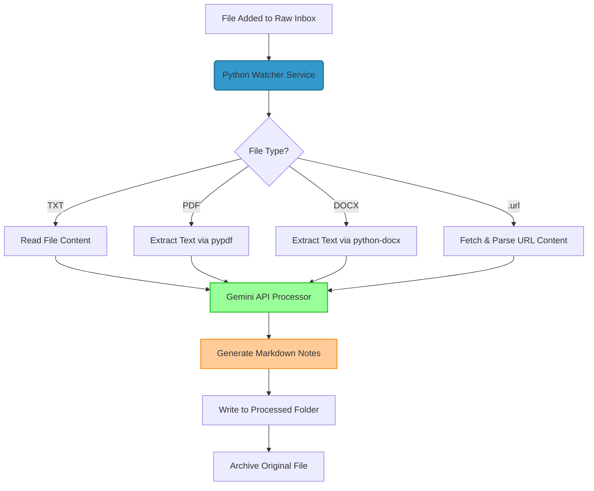

# Architecture

> System-level design. Update when modules, contracts, or data models change.

## Overview

The Obsidian Vault Inbox Watcher is a fully autonomous client-side agent service that monitors a directory, processes files locally using Python, extracts text contents based on mime-types, prompts the Google Gemini API to structure the data, and writes structured Markdown files into an Obsidian Vault directory.



## Module Map

```text
src/obsidian_inbox_watcher/
├── __init__.py           # Package imports
├── __main__.py           # Executable entrypoint
└── main.py               # Monolithic, highly-optimized service
    ├── load_api_key()             # Config/Env loading
    ├── wait_for_file_to_be_written() # Size stability check
    ├── process_file()             # Ingestion & Extraction pipeline
    ├── InboxHandler(FileSystemEventHandler) # Directory observer
    └── main()                     # Startup bootstrap & monitor loop
```

## Data Model & Formats

### Supported Inputs
1. **TXT (`.txt`)**: Read as standard UTF-8 string.
2. **PDF (`.pdf`)**: Parsed page-by-page via `PdfReader` from `pypdf`.
3. **DOCX (`.docx`)**: Parsed paragraph-by-paragraph via `docx.Document`.
4. **URL (`.url`)**: Parsed using standard `ini` structure looking for `URL=...`. Web page is requested using `requests` with a Chromium user-agent and HTML tags (`script`, `style`, `nav`, `footer`, etc.) decomposed via `BeautifulSoup` to isolate readable body text.

### Output Obsidian Markdown Note
```markdown
---
created: YYYY-MM-DD
source: [Absolute File Path or Crawled URL]
category: [Trading | Informatik-Studium | Lucke Capital Services | IT-Infrastruktur]
tags: ["tag1", "tag2", "tag3", "tag4", "tag5"]
ai_processed: true
---
# [Precise German Title]

## Zusammenfassung
[German Summary]

## Wissenslücken / Fragen an mich
> [!IMPORTANT]
> [Identified Questions or Knowledge Gaps]

## Action Items
- [ ] [Action Item 1]
- [ ] [Action Item 2]
```

## External Services
1. **Google Gemini API**: Utilizes `gemini-2.5-flash` model with structural output enforcement (`response_mime_type="application/json"`). Relevancy constraints are enforced to map to predefined user projects. Requires a valid `GEMINI_API_KEY` loaded from `~/.config/vault_watcher/env` or system environment.
2. **Target Web Servers**: Requested dynamically when processing `.url` shortcuts to fetch information. Timeout is set to 15s.

## Data Flow
1. **Detection**: `watchdog`'s `Observer` captures file creation event.
2. **Settle**: Active loop waits up to 10 seconds for file size to stabilize.
3. **Extraction**: Readable text is isolated based on extension.
4. **API Prompting**: Prepares a strict German system instruction prompt and sends it to the Gemini client.
5. **Obsidian Write**: Parses the returned JSON schema and saves the YAML frontmatter note with date/title under `~/Vault/00_Inbox/Processed`.
6. **Clean**: Original file is moved into `~/Vault/00_Inbox/Raw/Archive` (with a timestamp suffix added if it already exists).

## Deployment

The service is deployed locally as a **Systemd User-Level Service** under user `charlie`.
- **Unit Configuration**: Located in `deploy/obsidian-inbox-watcher.service`.
- **Environment**: Reads `EnvironmentFile=/home/charlie/.config/vault_watcher/env`.
- **Executable**: Starts via `/home/charlie/Arbeitsplatz/Code/Projekte/obsidian-inbox-watcher/.venv/bin/obsidian-inbox-watcher`.
