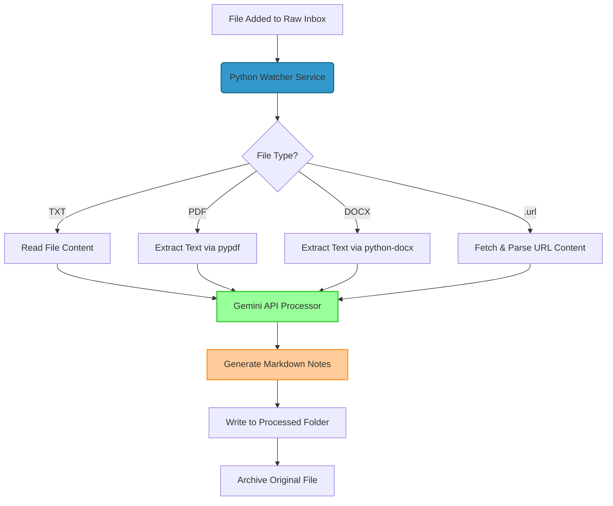

# Architecture

> System-level design. Update when modules, contracts, or data models change.

## Overview

The Obsidian Vault Inbox Watcher is a fully autonomous client-side agent service that monitors a directory, processes files locally using Python, extracts text contents based on mime-types, prompts the Google Gemini API to structure the data, and writes structured Markdown files into an Obsidian Vault directory.



## Module Map

```text
src/obsidian_inbox_watcher/
├── __init__.py           # Package imports
├── __main__.py           # Executable entrypoint
└── main.py               # Single-module service
    ├── load_env_file()              # Load ~/.config/vault_watcher/env into os.environ
    ├── resolve_dir()                # Read a dir from an env var, else default
    ├── get_known_domains()          # Seed domain list (VAULT_WATCHER_DOMAINS)
    ├── normalize_domain()           # Lowercase, space-free token for Qdrant filter
    ├── get_max_chars()              # Prompt char limit (VAULT_WATCHER_MAX_CHARS)
    ├── load_api_key()               # Gemini key from env / config file
    ├── _filesystem_type()           # /proc/mounts lookup of the backing fs
    ├── select_observer(watch_dir)   # PollingObserver on drvfs/9p/network fs, else inotify
    ├── wait_for_file_to_be_written()# Size-stability check
    ├── _is_transient() / _retryable # Retry predicate + shared tenacity policy
    ├── _http_get() / _generate_note_json()  # Retried URL fetch + Gemini call
    ├── _extract_text(filepath, ext) # txt/pdf/docx/url → (text, source_origin)
    ├── _dead_letter()               # Move unprocessable input → failed_dir + .error.txt
    ├── unique_output_path()         # Non-clobbering note path (_v2/_v3 suffix)
    ├── process_file(processed_dir, archive_dir, failed_dir)  # Extract + Gemini + write/archive/dead-letter
    ├── process_existing_files()     # Drain files already present at startup
    ├── InboxHandler(processed_dir, archive_dir, failed_dir)  # on_created/on_moved → _maybe_process → process_file
    ├── _rescan_loop()               # Daemon thread: periodic safety-net rescan
    └── main()                       # Resolve config, start observer + rescan, monitor loop
```

## Data Model & Formats

### Supported Inputs
1. **TXT (`.txt`)**: Read as standard UTF-8 string.
2. **PDF (`.pdf`)**: Parsed page-by-page via `PdfReader` from `pypdf`.
3. **DOCX (`.docx`)**: Parsed paragraph-by-paragraph via `docx.Document`.
4. **URL (`.url`)**: Parsed using standard `ini` structure looking for `URL=...`. Web page is requested using `requests` with a Chromium user-agent and HTML tags (`script`, `style`, `nav`, `footer`, etc.) decomposed via `BeautifulSoup` to isolate readable body text.

### Output Obsidian Markdown Note

`domain` is first and is **required by Titan** (`read_markdown` raises if it is
missing/empty; set `indexed: false` to skip a note instead). It is normalized to
a lowercase, space-free token because Titan filters on it exactly in Qdrant. The
H1 becomes Titan's `document_title`. The other frontmatter keys are extra context
for Obsidian and are ignored by Titan.

```markdown
---
domain: [existing Titan domain or a new one Gemini chose]
created: YYYY-MM-DD
source: [Absolute File Path or Crawled URL]
tags: ["tag1", "tag2", "tag3", "tag4", "tag5"]
ai_processed: true
---
# [Precise German Title]

## Zusammenfassung
[German Summary]

## Wissenslücken / Fragen an mich
> [!IMPORTANT]
> [Identified Questions or Knowledge Gaps]

## Action Items
- [ ] [Action Item 1]
- [ ] [Action Item 2]
```

## External Services
1. **Google Gemini API**: Utilizes `gemini-2.5-flash` model with structural output enforcement (`response_mime_type="application/json"`). The prompt receives the seed domain list (`VAULT_WATCHER_DOMAINS`) and classifies the content into one existing Titan domain or a new one. Requires a valid `GEMINI_API_KEY` loaded from `~/.config/vault_watcher/env` or system environment.
2. **Target Web Servers**: Requested dynamically when processing `.url` shortcuts to fetch information. Timeout is set to 15s.

## Data Flow
1. **Detection**: `watchdog` fires `on_created` (normal create) or `on_moved` (temp-write-then-rename, e.g. Syncthing). Both route through `InboxHandler._maybe_process`, which skips the archive dir, applies the extension allowlist, and guards against double-processing with an in-flight set. A daemon thread also rescans the raw dir every 60 s as a safety net for any missed event.
2. **Settle**: Active loop waits up to 10 seconds for file size to stabilize.
3. **Extraction**: `_extract_text` isolates readable text based on extension; the URL fetch is retried on transient failures. If the text exceeds `VAULT_WATCHER_MAX_CHARS` (default 200k) it is truncated and a warning is logged.
4. **API Prompting**: Prepares a strict German system instruction prompt and sends it to Gemini via `_generate_note_json`, which retries transient failures (429/5xx/network) with bounded exponential backoff.
5. **Obsidian Write**: Parses the returned JSON and saves the YAML-frontmatter note under `VAULT_WATCHER_PROCESSED_DIR` (default `~/0_Pipeline/Out`; set to `/mnt/f/vault/notes/inbox` in this deployment). `unique_output_path` appends a `_v2`/`_v3` suffix rather than overwrite an existing note.
6. **Clean**: Original file is moved into `VAULT_WATCHER_ARCHIVE_DIR` (default `~/0_Pipeline/Archive`), with a timestamp suffix if a same-named file already exists.
7. **Dead-letter (failure path)**: Any unprocessable input — unsupported format, empty text, extraction failure, exhausted retries, invalid JSON, or an unexpected error — is moved to `VAULT_WATCHER_FAILED_DIR` (default `~/0_Pipeline/Failed`) with a `<name>.error.txt` sidecar (timestamp + reason + short detail), so it leaves the inbox instead of being retried on every restart. A missing API key is treated as config and leaves the file in place.

## Integration with Titan (RAG)

This watcher is the document-processing front end to the Titan RAG service. The
two systems are decoupled through the shared filesystem — no code coupling:

```
PDF/DOCX/URL → (this watcher: Gemini → .md) → /mnt/f/vault/notes/inbox/
            → brain-watcher (polls /mnt/f/vault) → Titan /ingest/file → Qdrant
```

- Titan only accepts paths under `VAULT_ROOT` (`/mnt/f/vault`); brain-watcher
  watches that tree **recursively** with a polling observer (inotify is
  unreliable on the `/mnt` drvfs mount) and auto-ingests `.md` files.
- Therefore `VAULT_WATCHER_PROCESSED_DIR` is set inside the vault, while the raw
  and archive dirs stay outside it so raw inputs are never indexed.
- The raw inbox is a Windows folder (`/mnt/f/0_Pipeline/In`) so files can be
  dropped from Explorer; `select_observer()` uses a polling observer there
  because inotify events are not delivered on the drvfs mount.

## Hub migration (always-on Mini-PC)

The watcher is migrating from the WSL2 workstation to an always-on Mini-PC hub
(Ubuntu) so the workstation no longer needs to be awake to accept input. The hub changes two things that surfaced latent bugs
(now fixed in WI-1/WI-2/WI-3):

- The raw inbox is native **ext4** → `select_observer()` uses native **inotify**
  (no polling safety net), so the periodic rescan thread is the backstop.
- The inbox is fed by **Syncthing** (and optionally a sibling Telegram capture
  service), which delivers files by temp-write-then-rename → `on_moved`.

```
 Laptop / Phone ── Syncthing ─┐
 Telegram capture ────────────┤
                              ▼
            hub: /srv/cloud/inbox/raw/   (Syncthing, receive-only on hub)
                              │  on_created / on_moved
                              ▼
            obsidian-inbox-watcher (Gemini 2.5-flash)
              ├─ ok   → /srv/cloud/vault/notes/inbox/<note>.md  (Syncthing → workstation)
              ├─ ok   → /srv/cloud/archive/  (local only)
              └─ fail → /srv/cloud/failed/   (local only, + .error.txt sidecar)
                              │
          Syncthing mirrors vault/ ──┘
                              ▼
   workstation /mnt/f/vault ── brain-watcher (when PC on) ── Titan → Qdrant
```

**Syncthing folder boundaries (keep Titan clean):** `inbox/raw/` and `vault/` are
Syncthing folders; `archive/`, `failed/` (and a future `processing/`) are
**local-only, never synced**, so raw inputs never reach the vault and Titan.

## Deployment

Two systemd **user** units, one per host:

- **WSL workstation:** `deploy/obsidian-inbox-watcher.service`.
  - Environment: `EnvironmentFile=/home/<your-user>/.config/vault_watcher/env`.
  - Executable:
    `/home/<your-user>/projects/obsidian-inbox-watcher/.venv/bin/obsidian-inbox-watcher`.
- **Always-on hub:** `deploy/obsidian-inbox-watcher.hub.service`.
  - Adds `After=/Wants=network-online.target` (Syncthing-fed dirs) and
    `StartLimitIntervalSec=0` so it always restarts.
  - Paths under `/home/<hub-user>/...`; env file points the dirs at `/srv/cloud/*`.

Both load the Gemini key + `VAULT_WATCHER_*` overrides from the env file; `main()`
also calls `load_env_file()` so the same file works in dev runs. systemd does not
expand `~`, so the env file uses absolute paths. See `deploy/README.md`.
